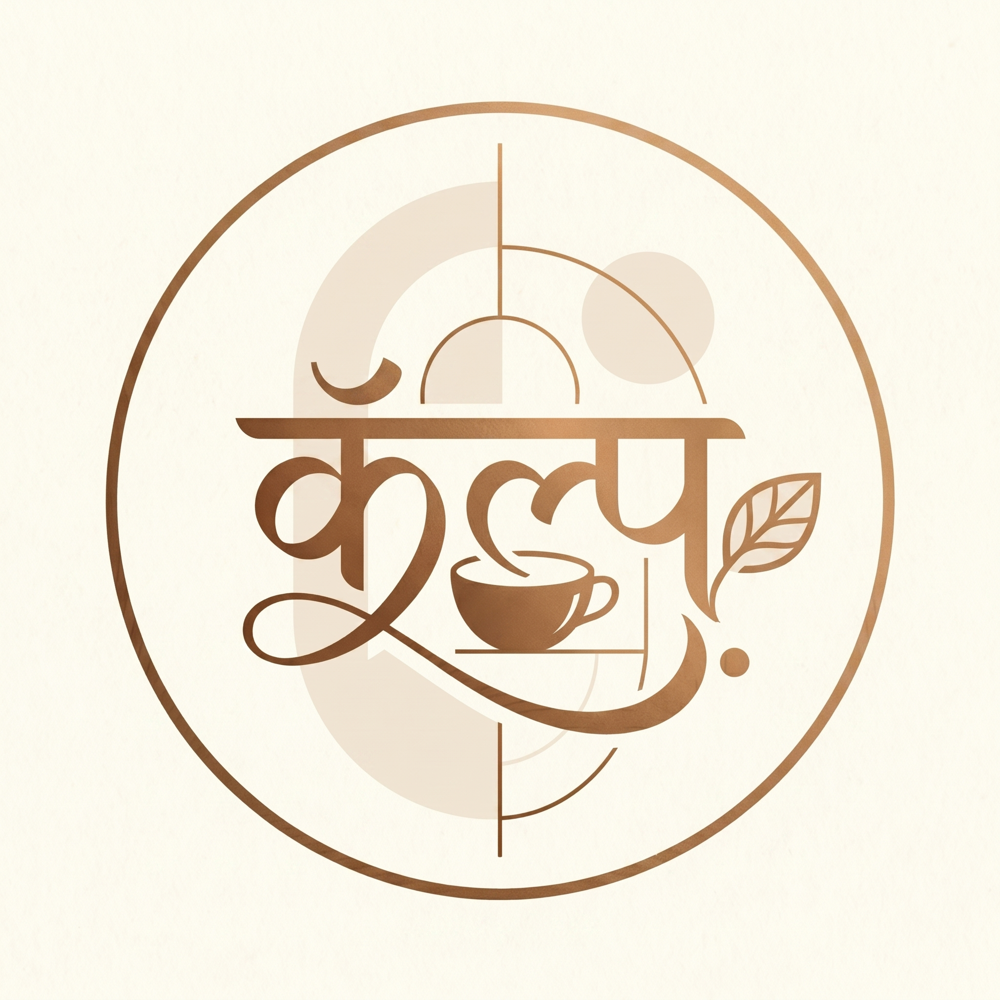

<picture>
  <source media="(prefers-color-scheme: dark)" srcset="assets/logo.png">
  
</picture>

<br>

# कल्प • Kalpa Coffee

**A full-stack café management system — slow, crafted, timeless.**

[](https://flutter.dev)
[](https://dart.dev)
[](https://supabase.com)
[](https://riverpod.dev)
[](https://pub.dev/packages/go_router)
[](https://flutter.dev)


---

**Kalpa** (कल्प) — Sanskrit for "imagination" or "a beautiful form" — is not a transactional kiosk. It is the quietest, most beautiful way to browse a menu and order from a table. For staff, it is a precise, warm tool that keeps the café running without feeling like a corporate POS. The app exists so the physical space can be what it is: *slow, crafted, human.*

> "The app should feel like part of the table — not a screen demanding attention."

---

## ✦ Experience

### For Guests

| | |
|---|---|
| **Browse the menu** | Real-time menu with categories, sizes, and milk preferences — powered by Supabase Realtime |
| **Scan the table** | QR code at your table opens your session. No sign-up required for dine-in |
| **Order at your pace** | Customise drinks, add to cart (survives app restarts via SharedPreferences), checkout when ready |
| **Track live** | Follow your order: *Pending → Prep → Ready → Served → Paid* |
| **Return anytime** | Phone OTP login unlocks profile, history, loyalty points, and favourites |

### For Staff & Management

| | |
|---|---|
| **Dashboard** | Real-time KPIs — pending orders, revenue, top-selling items, low-stock alerts |
| **Orders** | Live incoming orders with status progression. Filter by prep/ready/served/paid |
| **Menu management** | Add, edit, toggle availability, set prices and categories |
| **Table management** | Assign, free, and monitor tables. QR token generation per table |
| **Inventory** | Track stock levels, receive low-stock warnings (minimum thresholds) |
| **Staff & Expenses** | Employee profiles, expense tracking with categories |
| **Analytics** | Revenue charts, order status pie, daily/weekly trends via `fl_chart` |
| **Notifications** | Send in-app offers and announcements to all customers |
| **Members** | View registered customers, their order history, and loyalty points |

---

## ✦ Design Philosophy

Kalpa is designed around a single metaphor: **warmth without nostalgia.** The palette is drawn from a physical café at golden hour — copper fixtures, cream walls, deep espresso counters, the quiet green of a windowsill plant. Every surface feels tactile, like ceramic or wood grain, rendered through modern restraint.

**Guiding principles:**

- **Invisible technology** — The UI disappears into the experience. Transitions are patient (300–600ms), surfaces are flat at rest, shadows only appear on interaction.
- **One room, two views** — Customer and admin share the same design language. The dashboard is the same warm space seen from behind the counter.
- **The ≤10% accent rule** — Copper bronze (#9A6B3A) appears on at most 10% of any screen. Its rarity communicates that it matters.
- **No dark mode** — The café lives in sunlight and warm lamplight. Espresso dark (#2A1A0E) provides all needed contrast.
- **Craft reveals care** — Every typographic decision, spacing rhythm, and color choice communicates intentionality.

### Design System

```dart
// Core palette (from CafeColors)
primary:       Color(0xFF9A6B3A)  // Copper bronze — brand accent
secondary:     Color(0xFF2A1A0E)  // Espresso dark — structural
surface:       Color(0xFFFCFAF0)  // Warm cream — primary background
tertiary:      Color(0xFF7D8F79)  // Sage green — success & leaf
onSurface:     Color(0xFF1F1B16)  // Ink — warm near-black text
error:         Color(0xFFBA1A1A)  // Error red
success:       Color(0xFF2E8555)  // Success green
```

### Typography

| Role | Font | Weight | Size |
|------|------|--------|------|
| **Display** (hero headlines) | Outfit | 800 | `clamp(2.5rem, 5vw, 4rem)` |
| **Headline** (sections) | Outfit | 700 | `clamp(1.5rem, 3vw, 2rem)` |
| **Title** (card titles) | Plus Jakarta Sans | 600 | `clamp(1rem, 1.5vw, 1.375rem)` |
| **Body** (running text) | Plus Jakarta Sans | 400 | `1rem` |
| **Label** (buttons, chips) | Plus Jakarta Sans | 600, 1px tracking | `0.875rem` |

### Signature Component: The Double Bezel

Every card and container uses the double-bezel pattern — an outer stroke with an inset inner surface. This is Kalpa's primary spatial metaphor: objects within frames, like a tray on a table.

```dart
DoubleBezelContainer(
  outerRadius: 32,
  padding: 6,
  child: /* your content */,
)
```

---

## ✦ Architecture

```
kalpa_coffee/
├── lib/
│   ├── main.dart                     # Entry point, Impeller, Supabase init
│   ├── router.dart                   # GoRouter config with role-based guards
│   ├── animations/                   # Premium morph transitions, fade-in widgets
│   ├── data/
│   │   └── repositories/             # Supabase data access layer (Menu, Order, etc.)
│   ├── models/                       # Domain models (MenuItem, AppOrder, CartItem…)
│   ├── platform/                     # Platform-specific code (display mode, printing)
│   ├── providers/                    # Riverpod state (Auth, Cart, Menu, Order, Inventory…)
│   ├── screens/
│   │   ├── admin/                    # Dashboard, Orders, Menu, Tables, Inventory…
│   │   └── consumer/                 # Onboarding, Home, Checkout, Profile…
│   ├── theme/                        # M3Theme, CafeColors, AppColors (legacy bridge)
│   ├── ui/
│   │   └── core/widgets/             # DoubleBezelContainer, PremiumCtaButton…
│   ├── utils/                        # env_validator, security_layer, print_receipt…
│   └── widgets/                      # AdminSidebar, TopNavBar, CoffeeCard…
└── supabase/
    └── migrations/                   # Versioned SQL: schema, RLS, indexes, triggers
```

### State Management

All state is managed through **Riverpod 3.3+** `NotifierProvider`, with Supabase Realtime subscriptions streaming live updates:

```
┌──────────┐     ┌──────────────┐     ┌─────────────┐
│  Screen  │◄────│  Notifier    │◄────│  Repository  │
│ (Widget) │     │  (Provider)  │     │  (Supabase)  │
└──────────┘     └──────────────┘     └──────┬──────┘
                                             │
                                     ┌───────▼───────┐
                                     │  PostgreSQL   │
                                     │  + Realtime   │
                                     └───────────────┘
```

- **Auth** → `adminStatusProvider` caches role; invalidated on sign-in/token-refresh
- **Menu** → Supabase stream, falls back to curated mock data on first load
- **Cart** → SharedPreferences with 2-hour expiry (survives app restarts)
- **Orders** → Realtime subscription filtered to today's orders
- **Inventory / Staff / Expenses** → Realtime streams with optimistic UI updates

### Routing Security

GoRouter's `redirect` callback guards every route:

| Route | Guard |
|---|---|
| `/admin/*` | Requires Supabase auth session + `profiles.role == 'admin'` |
| `/home` | Requires `table_id` in SharedPreferences (from QR scan) |
| `/scan` | Public — QR scanner entry point |
| `/login` | Public — Phone OTP sign-in |

Admin status is cached in a Riverpod provider to avoid a Supabase query on every navigation.

---

## ✦ Tech Stack

| Layer | Technology |
|---|---|
| **Framework** | [Flutter 3.10+](https://flutter.dev) / [Dart 3.10+](https://dart.dev) |
| **State** | [Riverpod 3.3+](https://riverpod.dev) (NotifierProvider) |
| **Routing** | [GoRouter 17+](https://pub.dev/packages/go_router) |
| **Backend** | [Supabase](https://supabase.com) (PostgreSQL, Auth, Realtime, Storage) |
| **Auth** | Supabase Auth (Email/Password, Phone OTP) + `profiles.role` RBAC |
| **Cart persistence** | [SharedPreferences](https://pub.dev/packages/shared_preferences) (2-hour TTL) |
| **Images** | [cached_network_image](https://pub.dev/packages/cached_network_image) |
| **QR scanning** | [mobile_scanner](https://pub.dev/packages/mobile_scanner) |
| **QR generation** | [qr_flutter](https://pub.dev/packages/qr_flutter) |
| **Charts** | [fl_chart](https://pub.dev/packages/fl_chart) |
| **Animations** | [flutter_animate](https://pub.dev/packages/flutter_animate) |
| **Environment** | [flutter_dotenv](https://pub.dev/packages/flutter_dotenv) |
| **Fonts** | [Google Fonts](https://pub.dev/packages/google_fonts) (Outfit + Plus Jakarta Sans) |
| **Geo-security** | [geolocator](https://pub.dev/packages/geolocator) + [network_info_plus](https://pub.dev/packages/network_info_plus) |
| **Notifications** | [toastification](https://pub.dev/packages/toastification) |
| **Secure storage** | [flutter_secure_storage](https://pub.dev/packages/flutter_secure_storage) |
| **Platforms** | Android, iOS, Web, macOS, Windows, Linux |

---

## ✦ Getting Started

### Prerequisites

- Flutter SDK 3.10+
- A Supabase project ([free tier](https://supabase.com) works)
- An `assets/app.env` file (client-safe values — see below)

### Setup

```bash
# Clone and enter
cd kalpa_coffee

# Install dependencies
flutter pub get

# Run
flutter run -d chrome          # Web
flutter run -d macos           # macOS
flutter run                    # Auto-detect device
```

### Environment Variables

The app loads its config from **`assets/app.env`**, which is bundled into the
build. It must contain **only client-safe values** — anything here is readable
by anyone who unpacks a build, so never put the Supabase secret key or database
URL in it (those are protected server-side by Row-Level Security):

```env
# assets/app.env — bundled, client-safe only
SUPABASE_URL=https://your-project.supabase.co
SUPABASE_PUBLISHABLE_KEY=your-publishable-key
```

Server-side secrets (`SUPABASE_SECRET_KEY`, `DATABASE_URL`) belong in a
root-level `.env` that is **gitignored and never bundled** — used only for
local tooling such as running migrations. See [`main.dart`](lib/main.dart),
which calls `dotenv.load(fileName: "assets/app.env")` and validates the
required keys at startup.

### Database Migrations

```bash
supabase link --project-ref your-project-ref
supabase db push
```

| Migration | Purpose |
|---|---|
| `20260620000000_initial_schema.sql` | Core tables (profiles, orders, menu_items, inventory, cafe_tables, etc.), initial RLS, loyalty trigger |
| `20260630000000_profiles_role_and_rls.sql` | Adds `role` column to profiles, admin-gated order UPDATE policy |
| `20260701000000_add_order_update_rls.sql` | Tightens order update policy to owner-only |
| `20260708000001_add_customer_to_enum.sql` | Adds missing `'customer'` value to `user_role` enum |
| `20260708000002_create_trigger_and_backfill.sql` | Auto-creates profile row on signup + backfill for existing users |
| `20260709000000_security_hardening.sql` | Owner/admin-only order UPDATE policy + server-side order-total validation trigger |
| `20260709000001_drop_drifted_objects.sql` | Removes ad-hoc dashboard objects not in migration history (idempotent) |
| `20260709000002_security_hardening_linter.sql` | Resolves Supabase advisor/linter warnings (RLS, policy hygiene) |

> The initial schema migration is idempotent (`DROP … IF EXISTS` before each
> policy/trigger), so it is safe to re-run against a database that already has
> these objects.

### Build for Release

```bash
flutter build apk --release               # Android
flutter build ios --release               # iOS
flutter build web --release               # Web
flutter build macos --release             # macOS
flutter build windows --release           # Windows
flutter build linux --release             # Linux
```

---

## ✦ Row-Level Security

All tables have RLS enabled. The key protections:

- **Orders:** Anyone can view their own; only the owner or an admin can update status/payment
- **Order totals:** A `BEFORE INSERT/UPDATE` trigger recomputes the authoritative total from live `menu_items` prices + tax and rejects client-tampered amounts
- **Profiles:** Users see and edit their own profile; any authenticated user can read
- **Menu/Tables:** Public read, authenticated write
- **Inventory/Settings/Notifications:** Public read, authenticated write
- **Admin enforcement:** `SELECT id FROM profiles WHERE role = 'admin'` sub-queries in RLS policies

---

## ✦ Project Roadmap

| Phase | Focus | Status |
|---|---|---|
| **1. Foundation** | Architecture, schema, auth, routing, state | ✅ Complete |
| **2. Consumer features** | Scan-to-order, menu, cart, checkout, order tracking | ✅ Complete |
| **3. Admin dashboard** | KPI cards, revenue charts, order management, inventory | ✅ Complete |
| **4. Staff tools** | Menu/table/expense/staff management, notifications | ✅ Complete |
| **5. Kitchen Display** | Real-time order queue, preparation status, expediting | 🔜 Planned |
| **6. Analytics v2** | Labour, customer insights, custom reports, export | 🔜 Planned |
| **7. Offline mode** | Local-first with background sync on connectivity restore | 🔜 Planned |

---

## ✦ Contributing

This is a private codebase. All rights reserved.

---

## ✦ License

All rights reserved. Kalpa Coffee © 2026.

---

Haven't tested it properly on every platform, only on chrome and it works fine on it.
<p align="center">
  
  <br>
  <em>Handmade in light.</em>
</p>
